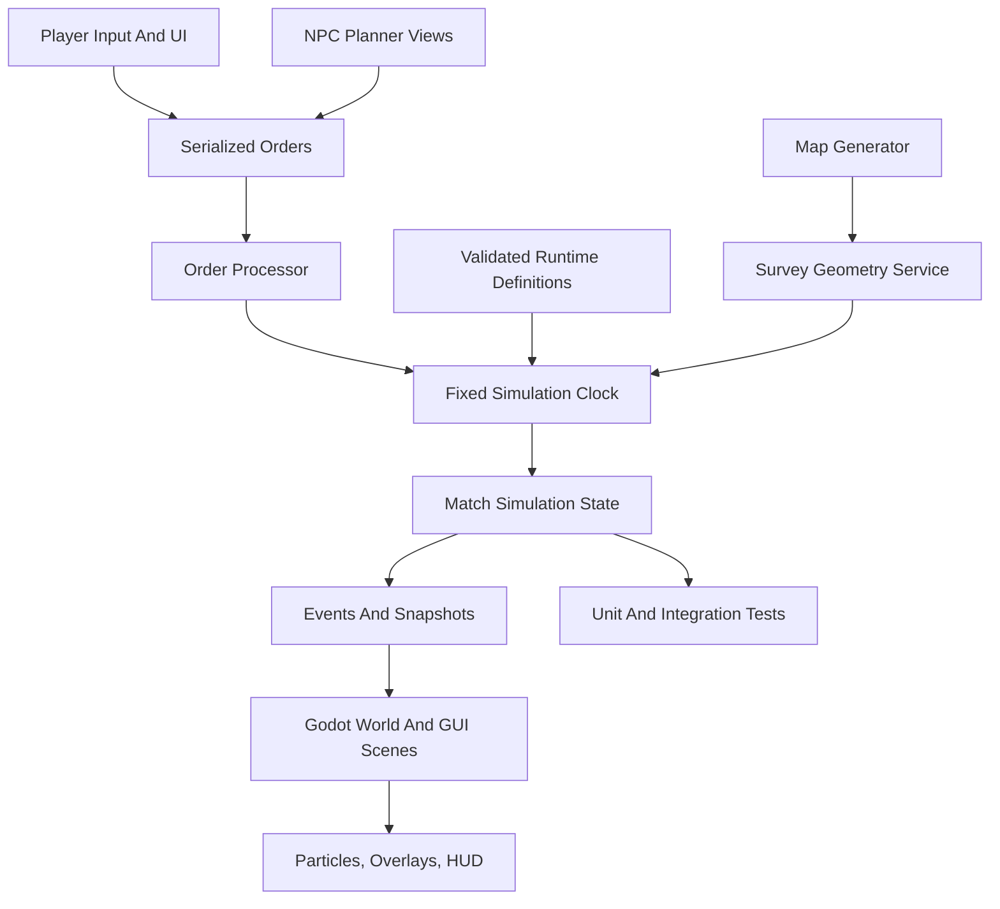
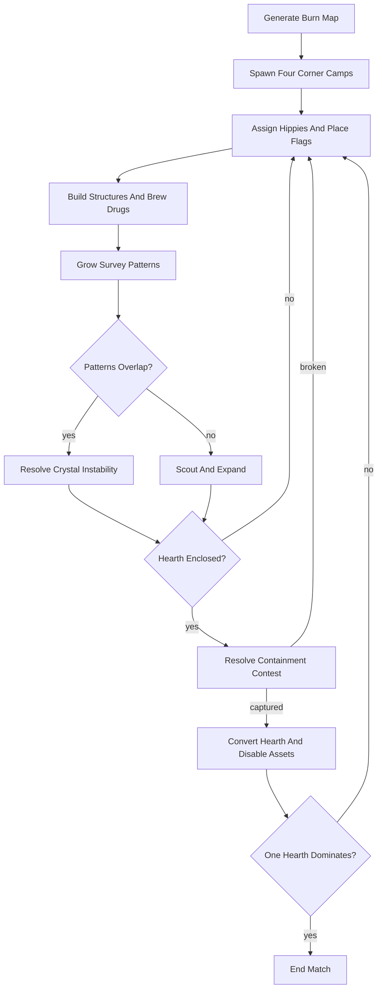
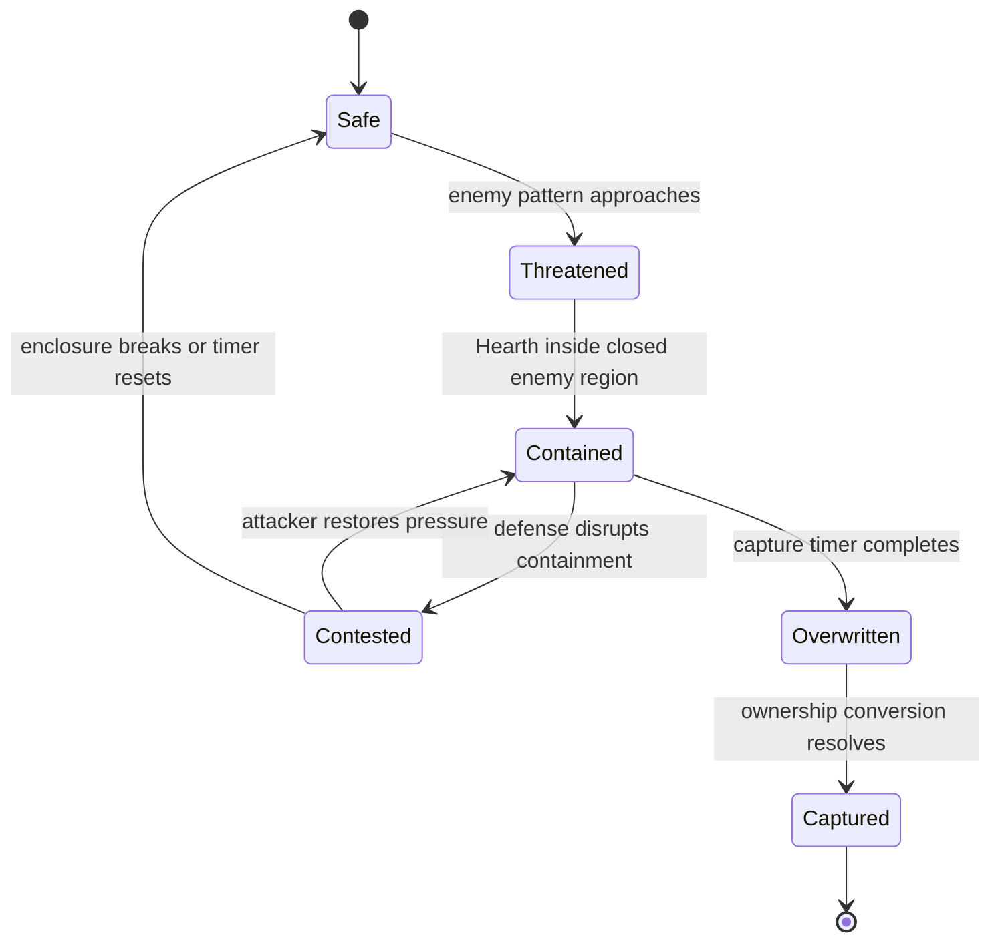

# feat: Build Survey Flags Playable Prototype

## Summary

Build the first Godot playable prototype for the Survey Flags game: a solo 1v1v1v1 command-heavy action strategy match where Survey Patterns grow from Flag Hearths and camps fall through Hearth containment. The plan creates a greenfield Godot project, fixed-tick simulation core, placeholder visuals, small first content rosters, NPC rivals, and automated coverage for the core match loop.

---

## Problem Frame

The requirements define a full first playable loop, but the repo currently contains only planning artifacts. Implementation therefore needs to establish project scaffolding and architecture before gameplay systems can land. The main planning challenge is keeping the first version broad enough to prove the fantasy while keeping every subsystem shallow, inspectable, and testable.

---

## Requirements

Plan-local IDs in this section use `R<N>`. Upstream requirements from the origin document are cited as `origin R<N>`.

**Playable Match**

- R1. The prototype shall run a full solo 1v1v1v1 match from four corner camps to a camp-conquest end state.
- R2. The map generator shall guarantee four-corner starts, a central burn landmark, neutral contested space, and enough obstacle variety to make expansion paths matter.
- R3. The match shall support placeholder visuals and readable debug overlays before final pixel art exists.

**Survey Pattern And Hearth Conquest**

- R4. Each vexillomancer shall grow a personal Survey Pattern from placed Flags and assigned target vertices.
- R5. A rival Flag Hearth shall enter a visible capture state when enclosed by an enemy Survey Pattern.
- R6. Pattern overlap shall create Crystal instability that affects units, buildings, Flag tasks, and local tactics without requiring exact scientific simulation.
- R7. Capturing a Hearth shall resolve camp ownership, captured assets, hippie state, and post-capture order validity.

**Command Economy**

- R8. Hippies shall be recruitable, commandable, interruptible, and able to perform Flag, building, defense, and raid work through attention.
- R9. The first building roster shall include Flag production, hippie recruitment, Hearth defense, and drug brewing.
- R10. The first drug roster shall include tactical, attention, hidden-information, and chaos-risk effects with visible risks.
- R11. Chakra alignment shall unlock point-click command abilities through ritual economy rather than territory ownership.

**Implementation Quality**

- R12. Core match rules shall be testable outside frame rendering and scene animation.
- R13. Godot scenes shall consume simulation snapshots and submit orders without owning match truth.
- R14. The implementation shall keep player-facing text in Survey Flags vocabulary and avoid player-facing quasicrystal terminology.

---

## Key Technical Decisions

- **Godot 4.6.x with GUT 9.6.0 initial baseline.** Start on the documented Godot/GUT compatibility pair and treat Godot 4.7 as an explicit upgrade after scaffold tests pass, because Godot minor upgrades can include migration work and the current GUT docs target Godot 4.6.
- **Typed GDScript first.** Use Godot scenes, typed GDScript, and Resources for fast game-feel iteration. Rust/GDExtension remains gated on profiling evidence, a narrow data boundary, and platform-risk review.
- **Fixed-tick order simulation.** All match state mutation goes through a simulation clock, serialized orders, validation results, seeded RNG streams, and emitted simulation events or snapshots.
- **Resources are authoring assets.** Building, drug, ability, and faction Resources load as immutable definitions and are copied into plain runtime state. Simulation state must not hold `Node`, `SceneTree`, or presentation references.
- **Graph-cell Survey geometry.** The prototype uses map-cell and graph-region containment rather than arbitrary polygon loops. This is less visually exact but keeps Hearth containment, AI, overlays, and tests on one geometry authority.
- **Data-driven first rosters.** Define buildings, drugs, chakra abilities, and factions as content assets so balance changes do not require scene logic changes.
- **NPC parity through planner views.** NPC vexillomancers consume restricted planner snapshots and submit the same serialized orders as the player. Their first planner can be coarse and may stage advanced drugs/chakras behind simpler expand/defend/capture behavior.
- **Scene layer as presenter/controller.** Godot scenes render simulation snapshots, collect input, and emit order requests. UI never owns the match truth.

---

## High-Level Technical Design

### Component Shape



The simulation owns truth for Flags, hippies, buildings, Hearths, Survey Patterns, drugs, abilities, capture, and match victory. Godot scenes render and animate snapshots, while UI and NPC planners submit orders through the same processor.

### Match Loop



### Hearth Capture State Machine



Capture feedback should expose these states through overlays and HUD text. The player should not need to infer capture from geometry alone.

### Prototype Capture Rules

- Containment pressure accrues only while a Hearth is inside an enemy closed graph region.
- Defender disruption pauses or reverses pressure when enough required vertices are broken or defended.
- Simultaneous attackers compete by containment pressure; the highest active pressure owns the overwrite if it completes.
- A captured Hearth becomes an outpost for the captor, the former faction loses that camp, buildings become disabled until repaired, and remaining hippies become neutral recruitables.
- A faction with no active Hearths cannot issue normal camp orders.

---

## Output Structure

```text
project.godot
.gutconfig.json
README.md
addons/gut/
assets/placeholders/
resources/buildings/
resources/drugs/
resources/abilities/
resources/factions/
resources/text/
scenes/main/
scenes/match/
scenes/map/
scenes/units/
scenes/buildings/
scenes/ui/
scripts/core/
scripts/sim/
scripts/map/
scripts/ai/
scripts/ui/
tests/unit/
tests/integration/
docs/brainstorms/
docs/plans/
```

Use snake_case for folders and file names and reserve PascalCase for Godot node/class names where useful. The exact structure may adjust during implementation, but the plan expects a clear split between simulation scripts, Godot scenes, content resources, placeholder assets, and tests.

---

## Implementation Units

### U1. Godot Project Scaffold And Test Harness

- **Goal:** Create the Godot project foundation, directory structure, placeholder asset conventions, README, version baseline, and automated test harness.
- **Requirements:** R3, R12, R13.
- **Dependencies:** None.
- **Files:** `project.godot`, `.gutconfig.json`, `README.md`, `addons/gut/`, `assets/placeholders/`, `scenes/main/main.tscn`, `scripts/core/game_constants.gd`, `tests/unit/test_project_bootstrap.gd`.
- **Approach:** Pin Godot 4.6.x and GUT 9.6.0 as the initial baseline, configure GUT to use `tests/unit/` and `tests/integration/`, add a minimal main scene, and document the upgrade policy. Keep project warnings visible for project scripts even if addon warnings are filtered.
- **Patterns to follow:** Godot project organization should favor clear scene/resource boundaries, snake_case file names, and small scenes over engine-clever abstractions.
- **Test scenarios:**
  - Opening the project loads the main scene without missing scripts or broken resource paths.
  - The test harness discovers tests from both configured test directories.
  - Placeholder assets load from the expected asset namespace without scene dependency cycles.
  - The README records the exact Godot and GUT versions used by the scaffold.
- **Verification:** The project opens in Godot, the main scene displays a placeholder shell, and automated tests can run headlessly.

### U2. Core Simulation Model

- **Goal:** Define match state, fixed tick processing, serializable orders, stable IDs, seeded RNG, events, snapshots, factions, camps, Hearths, Flags, hippies, buildings, resources, and victory.
- **Requirements:** R1, R4, R8, R12, R13; origin actors A1-A6 and flows F1-F2.
- **Dependencies:** U1.
- **Files:** `scripts/sim/match_state.gd`, `scripts/sim/simulation_clock.gd`, `scripts/sim/order_processor.gd`, `scripts/sim/sim_event.gd`, `scripts/sim/faction_state.gd`, `scripts/sim/camp_state.gd`, `scripts/sim/flag_state.gd`, `scripts/sim/hippie_state.gd`, `scripts/sim/building_state.gd`, `tests/unit/test_match_state.gd`, `tests/unit/test_order_processor.gd`, `tests/unit/test_flag_state.gd`.
- **Approach:** Model gameplay as explicit state plus validated orders rather than scene-node mutation. Include stable IDs, movement history, ownership/control context, and event/snapshot output from the start.
- **Execution note:** Implement core state behavior test-first because later scene code will depend on these invariants.
- **Patterns to follow:** Preserve the finite Flag economy idea from `flaghack2`, but do not import its update/render coupling.
- **Test scenarios:**
  - Covers origin AE1. Placing a carried Flag removes it from inventory, adds it to map state, updates movement history, and emits an event.
  - Direct pickup, drop, reposition, invalid placement, ownership/control changes, and rival Flag movement behave through validated orders.
  - Covers origin AE2. Assigning Survey work creates orders that hippies can claim when attention is available.
  - A faction cannot spend more attention or Flags than it owns.
  - Serialized orders and snapshots contain stable IDs and no scene references.
  - Replaying a seeded order sequence produces the same state hash for core fields.
  - Invalid orders fail safely and leave match state unchanged.
- **Verification:** Core simulation tests prove conservation, order validation, stable IDs, replay baseline behavior, camp ownership, and winner detection.

### U3. Survey Pattern Geometry And Crystal Instability

- **Goal:** Implement generated Survey Pattern vertices, graph-region fulfillment, Hearth containment checks, capture resolution, and overlap-driven Crystal instability.
- **Requirements:** R4, R5, R6, R7, R14; origin requirements R8-R16 and origin acceptance examples AE1, AE3, AE8.
- **Dependencies:** U2.
- **Files:** `scripts/sim/survey_pattern.gd`, `scripts/sim/pattern_vertex.gd`, `scripts/sim/survey_geometry_service.gd`, `scripts/sim/crystal_instability.gd`, `scripts/sim/hearth_capture.gd`, `tests/unit/test_survey_pattern.gd`, `tests/unit/test_hearth_capture.gd`, `tests/unit/test_crystal_instability.gd`.
- **Approach:** Generate each faction's Survey Pattern from a seed and faction signature, then constrain targets through the map graph. The geometry service owns target vertices, fulfilled vertices, closed regions, overlap regions, and Hearth containment queries.
- **Technical design:** Directional model only: a Survey Pattern exposes graph targets, fulfilled vertices, closed regions, overlap regions, and instability events. It does not expose Penrose or quasicrystal terminology to UI.
- **Patterns to follow:** Carry forward `flaghack2`'s emphasis on visible spatial geometry while replacing pentagram-first detection with Survey Pattern regions.
- **Test scenarios:**
  - Covers origin AE1. Filling a target vertex marks it fulfilled and updates the faction's active pattern.
  - Covers origin AE3. A Hearth inside an enemy closed region enters containment.
  - Capture timer progress, pause, reset, and completion respond to containment and defender disruption thresholds.
  - Simultaneous attackers resolve overwrite ownership by active containment pressure.
  - Captured camp ownership, disabled assets, neutral hippies, retained Flag history, and post-capture order validity resolve consistently.
  - Covers origin AE8. Overlapping rival regions produces bounded instability events with faction attribution.
  - Instability can affect hippies, buildings, Flag tasks, and capture pressure; it decays after overlap resolves.
  - Different faction seeds produce distinct target layouts on the same map seed.
- **Verification:** Geometry and capture tests cover stable, threatened, contained, contested, overwritten, and captured Hearth states without scene rendering.

### U4. Random Burn Map And Four-Corner Match Setup

- **Goal:** Generate a playable burn map with four balanced starting camps, a central landmark, neutral spaces, obstacles, field-condition hooks, and reachable Survey Pattern targets.
- **Requirements:** R1, R2, R3, R4; origin requirements R1-R5 and flow F1.
- **Dependencies:** U2, U3.
- **Files:** `scripts/map/burn_map_generator.gd`, `scripts/map/map_cell.gd`, `scripts/map/starting_camp_placer.gd`, `scenes/map/burn_map.tscn`, `tests/unit/test_burn_map_generator.gd`, `tests/integration/test_match_setup.gd`.
- **Approach:** Start with a seedable cell map that guarantees four corners and central burn space before adding messy camp roads, obstacles, mud/dust zones, and neutral Flag opportunities. Feed map reachability into Survey Pattern target generation.
- **Test scenarios:**
  - A fixed seed produces deterministic camp positions and central landmark placement.
  - Every generated map has four reachable starting camps and neutral space between them.
  - Starting camps receive comparable initial Flags, hippies, Hearth state, and buildable area.
  - Generated Survey Pattern vertices are reachable, buildable, not inside blocking obstacles, and useful from each corner start.
  - Field-condition tiles can affect movement or work modifiers without blocking all expansion paths.
- **Verification:** Generated map tests prove reachability, start parity, deterministic seeds, and usable build/Flag placement regions.

### U5. Hippie Automation, Attention, And Command Model

- **Goal:** Implement hippie recruitment, attention, job assignment, movement, Flag placement, defense, raid orders, interruption, and stale-job recovery.
- **Requirements:** R8, R12, R13; origin requirements R17-R21 and flows F1-F4.
- **Dependencies:** U2, U3, U4.
- **Files:** `scripts/sim/hippie_brain.gd`, `scripts/sim/attention_pool.gd`, `scripts/sim/job_assignment.gd`, `scripts/sim/raid_order.gd`, `scripts/ui/command_model.gd`, `tests/unit/test_hippie_jobs.gd`, `tests/unit/test_attention_pool.gd`, `tests/integration/test_automated_pattern_expansion.gd`.
- **Approach:** Treat hippies as workers that claim jobs from camp priorities. Keep command input coarse: assign priorities, mark areas, fill Survey Pattern vertices, defend Hearth, raid rival infrastructure, and gather or brew drug inputs.
- **Test scenarios:**
  - Covers origin AE2. Hippies assigned to Survey work can acquire a Flag and move it to an unfilled target vertex.
  - Attention limits prevent all jobs from running at full speed at once.
  - Defensive jobs respond to Hearth containment pressure before lower-priority work.
  - No available Flag supply, unreachable targets, occupied vertices, and canceled jobs leave recoverable job state.
  - Two hippies racing for one job cannot duplicate Flag claims or attention spend.
  - Attention exhaustion or disruption while carrying a Flag produces a recoverable dropped, reassigned, or resumed task.
  - Raid orders can disrupt a rival building or Flag task without bypassing normal movement and attention costs.
  - Distracted or debuffed hippies reduce output without deleting active jobs.
- **Verification:** Integration tests show a camp can expand its Survey Pattern through hippie automation with no hand placement after setup.

### U10. Thin Playable Scene Bridge

- **Goal:** Prove the input to order to simulation tick to overlay feedback path before the full content and NPC layers land.
- **Requirements:** R3, R4, R5, R12, R13; origin flows F1-F4 and origin acceptance examples AE1, AE3, AE8.
- **Dependencies:** U2, U3, U4, U5.
- **Files:** `scenes/match/match.tscn`, `scenes/ui/pattern_overlay.tscn`, `scripts/ui/match_controller.gd`, `scripts/ui/selection_controller.gd`, `scripts/ui/pattern_overlay.gd`, `tests/integration/test_thin_match_scene.gd`.
- **Approach:** Build a minimal playable scene with one player camp and one simple rival Hearth fixture. Support camera movement, player selection, direct Flag pickup/place, command issue, tick advance, Survey Pattern overlay, and Hearth capture feedback.
- **Test scenarios:**
  - The scene loads from a fixed seed and renders a minimal map, player, hippies, Flags, and a rival Hearth.
  - Player input submits orders and never mutates simulation state directly.
  - Direct Flag pickup, placement, invalid placement, and repositioning are reflected in the overlay.
  - Hearth capture state changes are visible after simulation ticks.
  - The camera and command mode can be used without hiding essential pattern/capture feedback.
- **Verification:** A local play session can place Flags, issue at least one hippie command, see pattern growth, and trigger a visible Hearth capture state before full content is complete.

### U6. Buildings, Drugs, Chakras, And First Content Rosters

- **Goal:** Add the first data-driven content rosters for buildings, drugs, chakra rituals, point-click command abilities, and their runtime definitions.
- **Requirements:** R9, R10, R11, R14; origin requirements R22-R36 and origin acceptance examples AE4-AE6.
- **Dependencies:** U2, U5, U10.
- **Files:** `resources/buildings/flag_workshop.tres`, `resources/buildings/recruitment_circle.tres`, `resources/buildings/hearth_ward.tres`, `resources/buildings/drug_lab.tres`, `resources/drugs/saffron.tres`, `resources/drugs/luminous_dust.tres`, `resources/drugs/acid_cop_vision.tres`, `resources/abilities/priority_beacon.tres`, `resources/abilities/stabilize_zone.tres`, `resources/abilities/forced_march.tres`, `scripts/sim/content_loader.gd`, `scripts/sim/building_catalog.gd`, `scripts/sim/drug_effect.gd`, `scripts/sim/chakra_ritual.gd`, `scripts/sim/ability_effect.gd`, `tests/unit/test_content_loader.gd`, `tests/unit/test_building_catalog.gd`, `tests/unit/test_drug_effects.gd`, `tests/unit/test_chakra_rituals.gd`.
- **Approach:** Use four buildings: Flag Workshop builds Flags faster, Recruitment Circle recruits hippies, Hearth Ward defends containment, and Drug Lab brews drugs. Use three drugs: Saffron boosts ritual/attention with overstimulation risk, Luminous Dust reveals hidden or unstable pattern state with confusion risk, and Acid Cop Vision exposes rival intentions or false signals with paranoia risk. Use three early abilities: Priority Beacon redirects hippies, Stabilize Zone reduces Crystal instability, and Forced March accelerates a selected work group with exhaustion risk.
- **Test scenarios:**
  - Covers origin AE4. Each first building modifies a distinct camp capability and can be placed, constructed, damaged, disabled, and repaired or recovered.
  - Invalid build sites and insufficient attention reject construction without spending resources.
  - Rival disruption of a building changes camp output through the same simulation systems as normal damage.
  - Covers origin AE5. Each first drug can be brewed, stored, targeted, used, expired, and surfaced in UI with at least one benefit and one risk or distortion.
  - Drug stacking or mutual exclusion rules are deterministic under seeded risk outcomes.
  - Covers origin AE6. Chakra rituals spend ritual economy and unlock or improve command abilities without checking territory size.
  - Ritual resources can be earned, rituals can complete or be interrupted, and abilities enforce cooldown/cost and invalid target rejection.
  - Ability effects route through the same order/simulation systems as normal commands.
  - Content validation catches missing cost, duration, effect, or lore-name fields.
- **Verification:** Content tests prove every first roster item loads, validates, applies effects, and stays within the command-heavy loop.

### U7. NPC Vexillomancer Planners

- **Goal:** Implement three rival NPC vexillomancers that expand, build, recruit, contest patterns, defend Hearths, and attempt conquest through restricted planner snapshots.
- **Requirements:** R1, R2, R4, R8, R9, R11, R13; origin requirements R1-R5, R9-R16, R17-R40 and origin acceptance example AE7.
- **Dependencies:** U2, U3, U4, U5, U6.
- **Files:** `scripts/ai/npc_vexillomancer_planner.gd`, `scripts/ai/planner_view.gd`, `scripts/ai/npc_strategy_profile.gd`, `resources/factions/player_faction.tres`, `resources/factions/rival_surveyor.tres`, `resources/factions/rival_brewer.tres`, `resources/factions/rival_warden.tres`, `tests/unit/test_planner_view.gd`, `tests/unit/test_npc_planner.gd`, `tests/integration/test_npc_free_for_all.gd`.
- **Approach:** Give NPCs the same orders and resources as the player but coarse strategy profiles. Start with expand, defend, build, raid, and capture priorities; only enable drugs/chakras for profiles once basic pressure is stable.
- **Test scenarios:**
  - Covers origin AE7. With no player input, NPCs expand, build, recruit, and pressure camps through visible systems.
  - Planner views hide debug-only state and expose only planner-appropriate snapshots.
  - NPC planners select valid orders from current match state and do not spend unavailable resources.
  - Different strategy profiles bias decisions without bypassing core rules.
  - At least one rival profile can use a drug or ability through visible resources.
  - NPCs can move or disrupt Flags, damage buildings, react to threatened Hearths, and attempt Hearth conquest.
  - A simulated free-for-all eventually produces conflict and potential camp elimination.
- **Verification:** Automated match simulations show NPCs can play the loop and create pressure without bespoke scripted events.

### U8. Full Godot Scenes, Controls, UI, And Feedback

- **Goal:** Expand the playable scene layer for movement, camera, selection, command issuing, buildings, units, overlays, HUD, particles, direct intervention, and match end.
- **Requirements:** R1-R14; origin flows F1-F5 and origin acceptance examples AE1-AE8.
- **Dependencies:** U6, U7, U10.
- **Files:** `scenes/units/vexillomancer.tscn`, `scenes/units/hippie.tscn`, `scenes/units/flag.tscn`, `scenes/buildings/flag_hearth.tscn`, `scenes/buildings/building.tscn`, `scenes/ui/hud.tscn`, `scenes/ui/command_panel.tscn`, `scripts/ui/hearth_capture_hud.gd`, `scripts/ui/debug_overlay.gd`, `tests/integration/test_match_scene_smoke.gd`, `tests/integration/test_player_intervention.gd`.
- **Approach:** Use a Main scene with separate World and GUI branches. Scenes receive injected match context, render simulation snapshots, and communicate through signals or order submission rather than shared mutable truth.
- **Test scenarios:**
  - The match scene loads from a generated seed and instantiates four factions without missing nodes.
  - Covers origin AE1. Player Flag placement through UI updates simulation and overlay state.
  - Covers origin AE3. Hearth capture states are visible in HUD and overlay feedback.
  - Covers origin AE4. Building placement UI rejects invalid locations and displays construction, disabled, and repaired states.
  - Covers origin AE5. Drug use shows duration, downside, hidden-information distortion, and expiry feedback.
  - Covers origin AE6. Chakra ability UI shows unlock, upgrade, cooldown/cost, and invalid target feedback.
  - Covers origin AE8. Crystal instability effects are visually triggered while preserving readable capture and command state.
  - Selecting and moving the vexillomancer allows urgent direct intervention during a raid or containment crisis without replacing command play.
  - Match end UI appears when one faction wins by camp conquest.
- **Verification:** A local play session can start a match, command hippies, place/build Flags, construct buildings, trigger instability, use a drug and ability, capture a Hearth, and end the match.

### U9. Lore Surface, Debug Tools, And Balancing Fixtures

- **Goal:** Add the minimal lore labels, debug overlays, seeded fixtures, and balancing knobs needed to tune the first playable without final art.
- **Requirements:** R3, R6, R10, R11, R14; origin Lore Guardrails, Canon Notes, and Success Criteria.
- **Dependencies:** U6, U8.
- **Files:** `resources/text/lore_terms.tres`, `scripts/ui/debug_overlay.gd`, `scripts/core/seed_config.gd`, `tests/integration/test_seeded_match_fixtures.gd`, `README.md`.
- **Approach:** Keep lore text concise and diegetic. Add debug toggles for Survey Pattern vertices, fulfilled vertices, closed regions, Hearth capture state, instability, attention, active jobs, drug effects, chakra abilities, and NPC intent.
- **Test scenarios:**
  - Player-facing labels use Survey Flags vocabulary and avoid exposed design-side physics terms.
  - Fixed debug seeds reproduce the same map, faction starts, and initial pattern vertices.
  - Debug overlays can be enabled without changing simulation results.
  - The README explains how to run a playable seed and how to interpret the debug overlays.
  - Debug fixtures can jump to opening growth, pattern collision, Hearth containment, and match-end states.
- **Verification:** Designers can reproduce a match state, inspect pattern/capture causes, and tune first-pass values without reading simulation internals.

### U11. Full Seeded Match Validation

- **Goal:** Validate that the shallow systems combine into a complete playable loop instead of isolated mechanics.
- **Requirements:** R1-R14; origin success criteria and origin acceptance examples AE1-AE8.
- **Dependencies:** U7, U8, U9.
- **Files:** `tests/integration/test_full_seeded_match.gd`, `tests/integration/test_captured_faction_orders.gd`, `README.md`.
- **Approach:** Use one or more fixed seeds to exercise setup, expansion, conflict, capture, faction elimination, and match end. Keep balance assertions loose enough for tuning while making loop completion mandatory.
- **Test scenarios:**
  - A seeded match can progress from four-corner setup to at least one camp capture.
  - A seeded match can progress to final surviving or dominant Hearth and match end screen.
  - Captured or eliminated factions cannot keep issuing normal camp orders.
  - Crystal instability, drug effects, chakra abilities, and building disruption can occur in the same match without corrupting core state.
  - Full-match validation records enough debug state to diagnose why a run stalled.
- **Verification:** The prototype has at least one reproducible seed that demonstrates the first playable loop from start to victory.

---

## Scope Boundaries

### Active Scope

- Greenfield Godot project scaffold.
- Full first playable loop in shallow form.
- Four-corner solo free-for-all against three NPC vexillomancers.
- Placeholder art and visual effects sufficient for readability.
- Fixed-tick core tests, order/snapshot tests, and Godot scene smoke tests.

### Deferred For Later

- Online multiplayer.
- Additional playable classes beyond Vexillomancer.
- Large authored campaign structure.
- Full final pixel art pipeline and title-screen collage work.
- Advanced containment-break stages outside the burn.
- Exact scientific simulation of the underlying aperiodic field behavior.
- Rust/GDExtension implementation unless profiling, platform support, and a narrow data boundary justify it.

### Outside This Product's Identity

- A pure action roguelike where the player personally does most combat.
- A pure RTS where the vexillomancer is only a cursor.
- A generic territory-control game with Flags as ordinary capture points.
- A game that presents itself as the true recovered original Flaghack without diegetic doubt.

### Deferred To Follow-Up Work

- Browser or export pipeline polish.
- Save/load, replays, and long-term progression.
- Rich AI personalities beyond coarse strategy profiles.
- Accessibility polish beyond basic readability and input remapping.
- Balance polish beyond making the first loop readable and reproducible.

---

## System-Wide Impact

This plan creates the project architecture, so early boundaries will shape every later feature. The simulation/order/snapshot boundary affects testing, NPC parity, future multiplayer, future Rust migration, and replayability. The content-loading boundary affects every roster and prevents Godot Resources from becoming mutable runtime state. The geometry service affects map generation, AI planning, UI overlays, capture rules, and Crystal instability.

---

## Risks And Dependencies

- **Godot workflow unfamiliarity.** Mitigate with conventional project layout, small scenes, a pinned version pair, and tests around domain scripts before scene polish.
- **Version drift.** Mitigate by pinning Godot 4.6.x with GUT 9.6.0 initially and treating Godot 4.7 as a documented upgrade.
- **Scope sprawl from full-loop ambition.** Mitigate by limiting rosters to four buildings, three drugs, three abilities, one class, and placeholder art.
- **System interaction explosion.** Mitigate by letting drugs, abilities, and advanced NPC profile behavior ship as simple status or numeric effects until the loop is readable.
- **Survey Pattern unreadability.** Mitigate with graph-cell geometry, debug overlays, capture state HUD, and first-class visual feedback before adding deeper effects.
- **NPC complexity.** Mitigate with restricted planner views, staged capability cuts, and coarse planners that use the same orders as the player.
- **Future multiplayer pressure.** Mitigate with serialized orders, stable IDs, seeded replay tests, and server-authoritative command application as a design constraint even though networking is out of scope.
- **Resource mutation leaks.** Mitigate by treating Resources as immutable authoring definitions and copying them into runtime definitions before simulation.
- **Lore overfitting.** Mitigate by using lore as verbs and constraints, not by attempting to simulate every wiki concept in v1.

---

## Acceptance Examples

- AE1. **Covers origin R6, origin R8, origin R10.** Given the player has a carried Flag, when they place it near a valid Survey Pattern position, then the pattern updates visibly and the Flag becomes part of the local geometry.
- AE2. **Covers origin R9, origin R17, origin R20.** Given hippies are assigned to Survey work, when a target pattern position lacks a Flag, then hippies can seek, build, or transport a Flag according to camp priorities and available attention.
- AE3. **Covers origin R13, origin R14, origin R16.** Given the player's Survey Pattern encloses a rival Flag Hearth, when the defender disrupts enough vertices before containment completes, then the capture state returns to contested or safe rather than completing.
- AE4. **Covers origin R22-R27.** Given the player has a functioning camp, when they build the first four building types, then each building contributes to Flag production, recruitment, Hearth defense, or drug brewing in a distinct way.
- AE5. **Covers origin R28-R31.** Given a drug is used, when its buff is active, then at least one meaningful downside, risk, hidden-information distortion, or chaos effect can change the player's decision.
- AE6. **Covers origin R32-R36.** Given the player performs a chakra ritual, when alignment succeeds, then a point-click command ability unlocks or improves without requiring the player to own more territory.
- AE7. **Covers origin R1, origin R2, origin R5.** Given a default match starts, when the player does nothing, then the three NPC vexillomancers still expand, build, recruit, and eventually pressure camps through visible systems.
- AE8. **Covers origin R11, origin R39, origin R40.** Given rival Survey Patterns overlap, when Crystal instability rises, then the game shows both spectacle and readable tactical consequences.
- AE9. **Covers plan R1-R14.** Given a fixed full-match seed, when the simulation and scene run through the scripted validation path, then the match reaches final Hearth dominance and shows the match end state.

---

## Documentation And Operational Notes

- Update `README.md` with the Godot version, GUT version, project layout, test harness, playable seed, debug overlays, and known prototype limitations.
- Keep the requirements doc linked from the README or plan references so future work can trace product decisions back to `docs/brainstorms/2026-06-21-survey-flags-game-requirements.md`.
- Record any decision to introduce Rust/GDExtension in a later plan rather than slipping it into this implementation opportunistically.
- Document fixed seeds for opening growth, pattern collision, Hearth containment, and full match completion.

---

## Sources And Research

- Origin requirements: `docs/brainstorms/2026-06-21-survey-flags-game-requirements.md`.
- Survey Flags wiki sources are linked from the origin requirements document.
- Prior prototype: https://github.com/drbeefsupreme/flaghack2
- Godot 4.7 release and migration note: https://godotengine.org/releases/4.7/
- Godot project organization: https://docs.godotengine.org/en/stable/tutorials/best_practices/project_organization.html
- Godot scene organization: https://docs.godotengine.org/en/stable/tutorials/best_practices/scene_organization.html
- Godot Resources: https://docs.godotengine.org/en/stable/tutorials/scripting/resources.html
- Godot GDExtension overview: https://docs.godotengine.org/en/stable/tutorials/scripting/gdextension/what_is_gdextension.html
- godot-rust: https://github.com/godot-rust/gdext
- Godot high-level multiplayer docs: https://docs.godotengine.org/en/stable/tutorials/networking/high_level_multiplayer.html
- GUT testing framework docs: https://gut.readthedocs.io/en/latest/

